# 0. Code
Link to [Github](https://github.com/HarshBabla99/qoptics_pkgs_benchmarks)

# 1. Time Evolution
Benchmarks for `sesolve` (for the lossless case) and `mesolve` (for the lossy case)

### 1.1.1: Driven cavity (Schrodinger Evolution)

| Save intermediate states | Don't save intermediate states |
|----------|----------|
| .json.png) |  |

### 1.1.2: Driven & lossy cavity (Time-independent Master Equation)

| Save intermediate states | Don't save intermediate states |
|----------|----------|
| .json.png) | 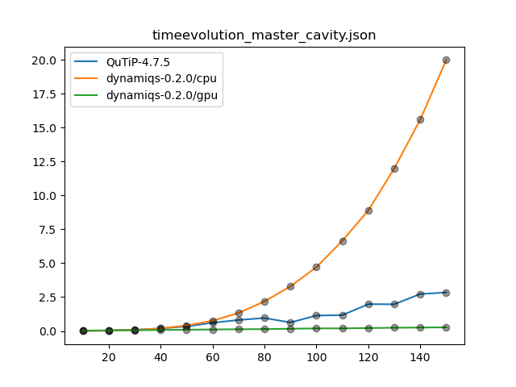 |

### 1.1.3: Driven & lossy cavity (Time-dependent Master Equation)

| Save intermediate states | Don't save intermediate states |
|----------|----------|
| .json.png) | 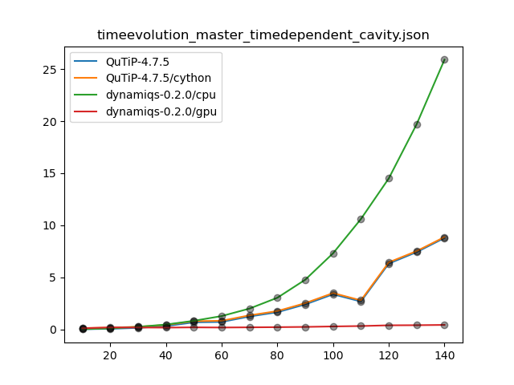 |

### 1.2.1: Jaynes-Cummings Hamiltonian (Schrodinger Evolution)

| Save intermediate states | Don't save intermediate states |
|----------|----------|
| .json.png) | 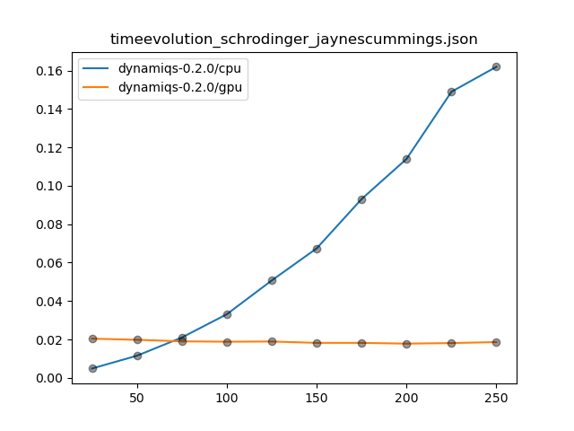 |

### 1.2.2: Jaynes-Cummings Hamiltonian (Time-independent Master Equation)

| Save intermediate states | Don't save intermediate states |
|----------|----------|
| .json.png) | 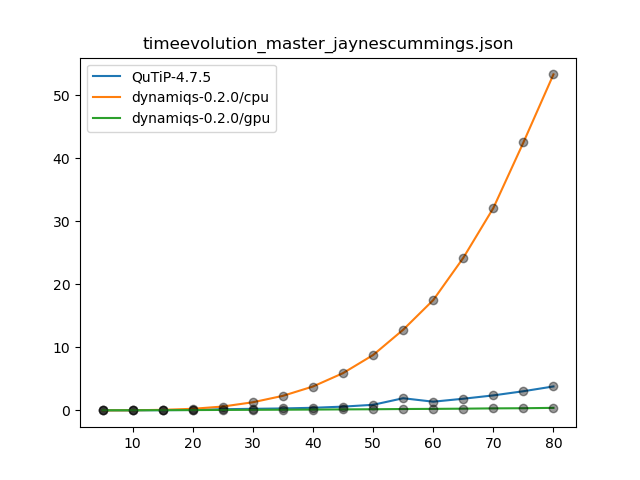 |

### 1.2.3: Jaynes-Cummings Hamiltonian (Time-dependent Master Equation)

| Save intermediate states | Don't save intermediate states |
|----------|----------|
| .json.png) | 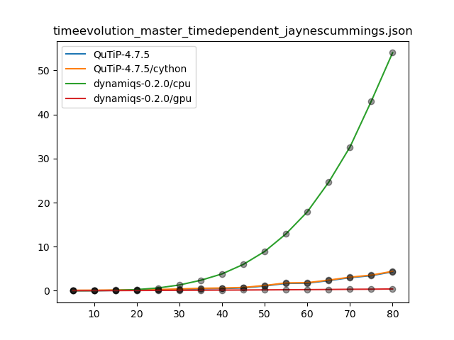 |

# 2. Helper functions

### 2.1: Expectation values

| On states | On operators |
|----------|----------|
| 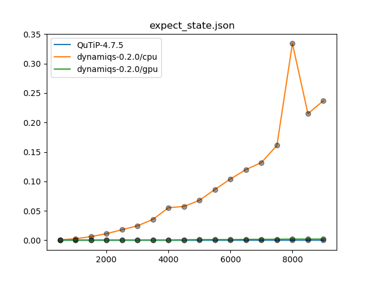 | 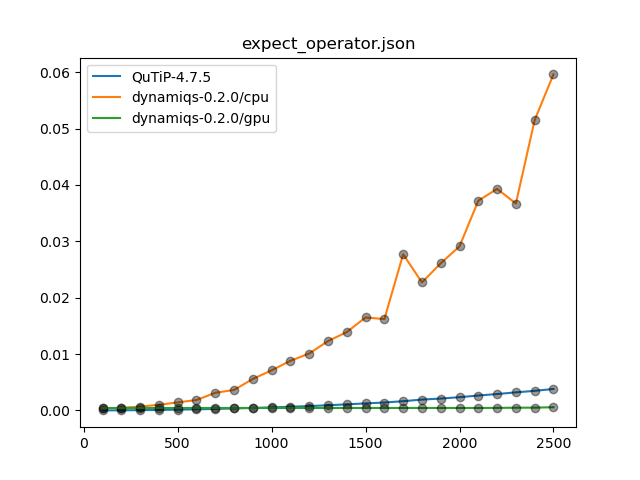 |

### 2.2: Wigner function

| On states | On operators |
|----------|----------|
|  |  |

### 2.3: Partial trace

| On states | On operators |
|----------|----------|
|  | 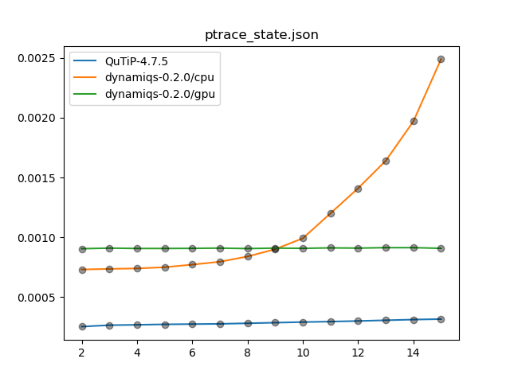 |

### 2.4: Coherent stes

| Using `coherent()` | Using `displace()` |
|----------|----------|
| 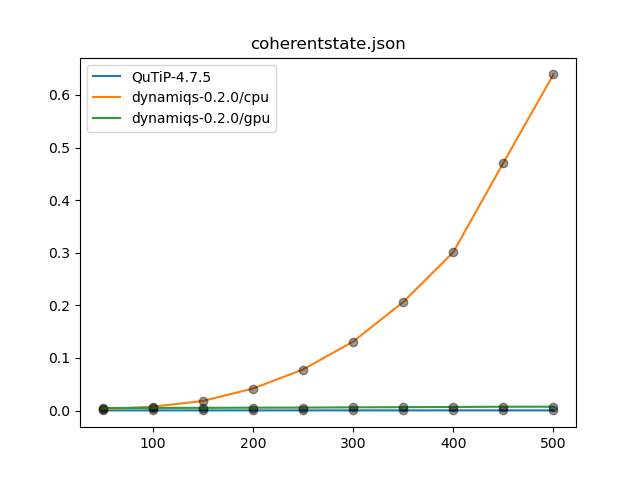 |  |

# 3. Arithmetic
These are all on dense operators & vectors (since dynamiqs doesn't support sparse operators yet)

### 3.1 Addition
| Operator-operator | 
|----------|
| 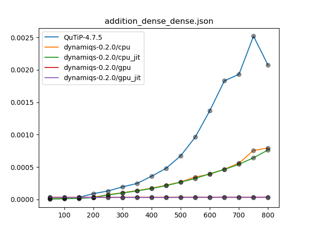 |

### 3.2 Multiplication
| Operator-operator | Bra-operator | Operator-Ket |  
|----------|----------|----------| 
|  | 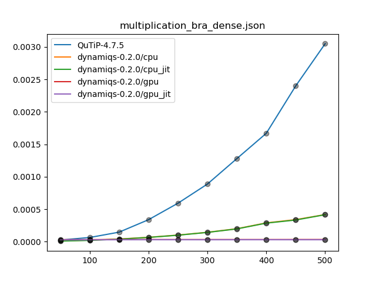 |  |  